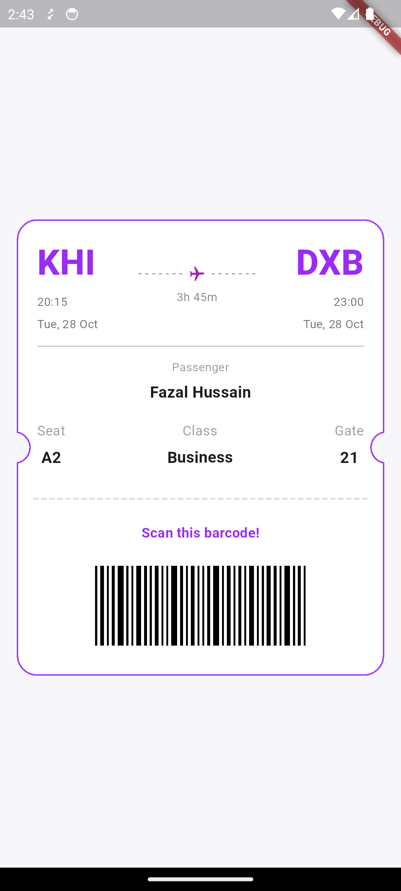

# flight_ticket_booking_card

A beautifully designed, reusable Flutter widget that creates an authentic-looking airline boarding pass/ticket card. Perfect for travel apps, booking confirmations, or any UI that needs a professional ticket design.

## Getting Started

Add the `TicketCard` widget anywhere in your app:

```dart
import 'package:flight_ticket_booking_card/ticket_card.dart';

Scaffold(
  body: Center(
    child: TicketCard(
      fromCode: 'JFK',
      toCode: 'LAX',
      passengerName: 'John Doe',
    ),
  ),
)

```

## Customization

```dart
TicketCard(
  fromCode: 'IST',
  toCode: 'BCN',
  fromTime: '20:15',
  toTime: '23:00',
  dateLabel: 'Fri, 16 August',
  passengerName: 'Jenny Simmons',
  seat: 'B2',
  travelClass: 'Business',
  gate: '41',
  cardBorderRadius: 20,
  cardNotchRadius: 16,
)

```

## Features

- Realistic ticket design with rounded corners and notches
-  Customizable flight details and passenger info
-  Perforated cut line separator
-  Barcode area
-  Zero dependencies - pure Flutter
-  Responsive (max width: 420px)

For detailed customization options and examples, see the code in lib/flight_ticket_booking_card/ticket_card.dart.

## Screenshots

```markdown



## License

No License

